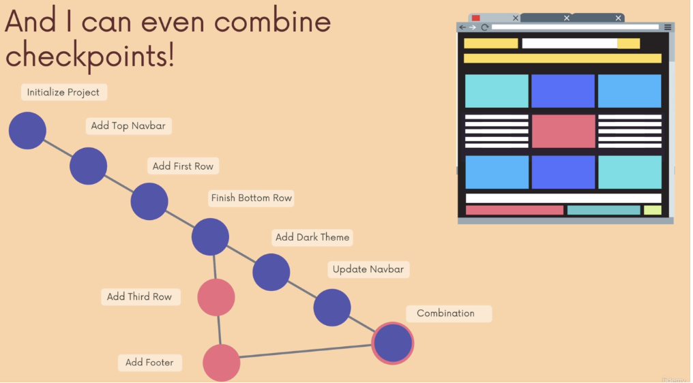
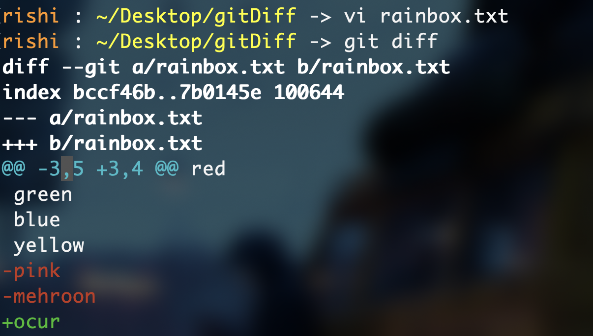

## What is VCS (Version Control System) ?

- Version Control System is a software that tracks and manages changes to files over time.
- Version Control System allows users to revisit earlier versions of the files, compare changes between versions, undo changes, and a whole lot more.

## What is GIT?

- Git is VCS.
- Git helps in many ways:
  a) Track changes across multiple files
  b) Compare versions of projects
  c) "Time Travel" back to old versions
  d) Revert to a previous versions
  e) Collaborate and share changes
  f) Combine changes
  <br>
  Git Workflow
  

  ### Difference between Git and Github?

  #### Git

  - Git a VCS that runs on your machine
  - Don't need account to use git
  - Even internet is not needed

  #### Github

  - Github is a service that hosts git repositories in the cloud and makes it easier to collaborate with other people.
  - Account is needed to use Github.

### Configuring Git

#### Configuring User Name

`git config --global user.name "<name>"`

#### Configuring User Email

`git config --global user.email "<name@domain.com>"`

You can change above whenever you want. This only helps in logs. Help to identify who had makes changes.

### What are Git Repos?

A Git "Repos" is a workspace which tracks and manages files within a folder.

### Initiate a new Git Repos

`cd Project`<br>
`git init #this initiate a new git repo`<br>
`git status #check the status of new repo created`

#### If you want to delete a git repo

`rm -rf .git`<br>

- Prevent your .git to automatically get deleted by changing the permission to (555)<br>
  `chmod 555 .git` or `chmod -x .git`

⚠️ DO NOT INIT A REPO INSIDE A REPO, VERIFY IT USING `git status` first

### What is git commit ?

Inside a git repository there are three working area named. First when someone makes changes to the files inside the working directory its gets added to the staging area using the command <br>`git add <file> <file> ...`

Commit area is a save point where new files can be added till you decide it either push it to remote repository or roll it back to delete the file.

Then using command <br>
`git commit -m "<msg>"` <br>
it can be moved to repository where .git keeps tracks of all the commited files.


#### How to perform best commits ?

- Try to do atomic commits.
- In atomic commits, try to keep each commit focused on a single thing
- Atomic commits also makes code easy to review

##### Which tense to use while writing a commit message?

- Github document shows that we should use Present-Tense Imperative Style technique.
- You can either use past tense or present tense.

### Git default commit editor setup!

`git config --global core.editor "code --wait"`
=>[link_For_all_editor](https://git-scm.com/book/en/v2/Appendix-C%3A-Git-Commands-Setup-and-Config)

### [About Git log](https://git-scm.com/docs/git-log)

- You can pretty print the git log also
- Suppose you only want one line of git log if the log message is very long you can use flag --oneline<br>
  `git log --oneline`

### Redoing previous commit

- Suppose you just made a commit and you realized that you forgot to include a file, or you made a typo in the commit message.
- Rather than making a brand new commit, you can redo the previous commit using command<br>
  `git commit --amend`

### Ignoring files

- Create a file with name as ".gitignore" in same directory.
- Inside this file enter the name of file and folder you want git to not track.
- `folderName/` will ignore an entire directory.
- `*.log` will ignore any file with .log extension. Here is \* is a wildcard

Note: Here gitignore.io which will help you to find all gitignore files for your project

## Branches

- Every commit in git contains a hash, a parent hash and a message.
- Branch are like alternative timelines for a project. They enable us to work on multiple things in parallel and they do not impact the other branches
- In 2020, Github renamed the default branch master to main.

#### What is HEAD?

- Head is simply a pointer that refers to the current "location" in your repository. It points to a particular branch reference
- It is possible to move around and HEAD will change.

###### Viewing all branches

- `git branch` -> This will show all branches.
- The \* before branch name shows in which branch you are on and currently working.

###### Creating and Switching branches

- `git branch <branch-name>` will create a branch, if branch does not exist.
- A branch name cannot include spaces.
- In order to switch between branches use `git switch <branch-name>`.

⚠️Note: `git add .` + `git commit -m <msg>` = `git commit -a -m "<msg>"`

##### Git Switch vs Git checkout

- Git switch is newer than git checkout
- Git switch only switches the branch, but checkout does alot more.
- There are different flags such as -b you can pass to create a branch
- Use git switch for simplisity

###### Git switch with -c

- If you want to create a new branch and switch it with same command you can use -c flag: <br>
- `git switch -c <branch-name>`

⚠️Note: You can't switch to another branch with unstaged changes. You either need to commit then or you can stash them.

### Deleting and renaming branches

##### Delete

- In order to delete branch first make sure it is merged with the main/master or not.
- After the successful merge use command: `git branch -d <branch-name>`. <br>
- If you want to delete the branch without merging use: `git branch -D <branch-name>`.<br>

##### Rename

- In order to rename branch -m flag is used.
- Also inorder the rename the branch you should be at that branch.
- Command to rename: `git branch -m <new-name>`<br>

### Merging

- If we want to incorporate changes from one branch to another merging is use.
- Command is `git merge <branch-name>`<br>
- Remember two merging concept:
  -- We merge branches not commits.
  -- We always merge to the current HEAD branch (change to branch where you want merge to happen then use the command to merge another branch to this branch)

#### There are three types of merges

- Fast-Forward Merge
- Merge Commit (No Conflicts)
- Merge Commit (Conflicts)

##### Fast-Forward Merge

- In fast forward merge we do not have any merge conflict. This means that new updated branch already contains all the works of the master/ main branch
- In this only the pointer of master branch gets shifted to the new branch HEAD position. (Easiest type of merge)

##### Merge Commit (No Conflicts)

- In this type of merge no conflict occur between the branches.
- In this the main/ master branch does not contain any changes that will create the conflict and merge can happen automatically

##### Merge Commit (Conflicts)

- In this type of merge conflict occur between the branches.
- In this the main/ master branch does contain any changes that will create the conflict and merge can not happen automatically.
- You have to manually edit the changes, you have to select which changes to keep and which changes to remove.

### Git Diff

- Git Diff is use to view changes between commits, branches, files, our working directory and more !
- Simple `git diff` shows changes in our current working directory that are not staged for the next commit.

```
line one in git diff shows two files on which comparisons are been made.

line two contains some hash (We don't need to worry about it).

line 3 contains files a and symbols represent whether data is added(+) or removed(-) from the file.

after that we have chunk
every chunk contains chunk header represented by "@@"
after chunk header changes are been shown
```

##### Chunk Header

- Chunk header representation `@@ <file a info> <file b info> @@`.
  
- Here -3, 5 represent that earlier file a contains 5 lines and changes had been made from line 3.
- +3, 4 represents that now file b contains 4 lines and changes had been made from line 3.

#### Different types of Git Diff

- Viewing unstaged changes.
- Viewing working directory changes.
- Viewing staged changes.
- Comparing changes across branches.
- Comparing changes across commits

###### Viewing unstaged changes

- Simple `git diff` command shows changes between the staged area and the changes made currently in the working directory.
- Staged area is the area after the `git add`. So after git add command any new changes made in the working directory can be seen using the `git diff` command.

###### Viewing working directory changes

- `git diff HEAD` will show all the changes in the working tree since your last commit.

###### Viewing staged changes

- `git diff --staged` will show all the changes between staged area and the last commit.

⚠️ We can also pass file name to get changes related to that file only.

###### Comparing changes across branches

- `git diff <branch1> <branch2>` will show all the changes between both these branches.
- In this order matters in which branches are written.

###### Comparing changes across commits

- `git diff <commit1_hash> <commit2_hash>` will show all the changes between both these commits.

### What is git stash ?

- Git stash provides easy way of stashing uncommit changes so that we can return back to it, without having to made unnecessary commits.
- Command is `git stash`, which saves most recent changes in the stash.
- In order to reapply changes back in the stash `git stash pop` is used. This command will remove changes from the stashing area and moves it back in the working directory.
- `git stash apply` will remove not remove the changes from the stash, but also reapply back in the working directory.
- `git stash apply ` is useful when we want to apply stash in multiple places (such as in multiple branch).

##### Working with multiple stash!!!

- To see all the things in the stash use `git stash`
- In order to apply particular stash use `git stash apply stash@{id}`

##### Removing everything from stash

- `git stash clear`

##### Remove specific stash

- `git stash drop stash@{id}`

### Undoing changes and Travelling back in time

- In order to checkout old commit `git checkout <commit_id>` command is use.
- This will detach the head from the last commit and attach the head to commit, whose commit_id is mentioned.
- You only will able to see the commit, make changes and it will not affect your initial commit.
- In order to move again to the latest commit use command `git switch <branch_name>` or `git switch -`.

#### Disregarding Changes

- Suppose you have typed something in the file unintentionally, now you want to revert back to the last commit.
- You can do this using command `git checkout HEAD <file_name>`.
- There is also another command introduced, a new command used nowadays `git restore <file_name>`.
- We can also time travel using `git restore --source HEAD~2 <file_name> `.

#### Unstaging Changes

- If you added the file using `git add` command for the next commit, but you don't want it.
- You can use the command `git restore --staged <file_name>` to unstage the changes.

#### Undoing Commits

- `git reset <commid_id>` will reset the repo back to a specific commit. The commits are gone.
- Above command will not lose the changes, only the commit history are gone.
- If you want to undo both the changes and the commits all together you need to use `git reset --hard <commit_id>`.<br>
- There is also one command `git revert`, it creates a new commit which undos the changes from a commit. Here you have to enter a message.

### Github

##### Push from local branch to remote branch with another name

- `git push origin <local_branch>:<remote_branch>`.

##### -u option in git push

- This options allows to set upstream of the branch we are pushing.
- So that next time we push we don't need to specify the branch name again and again. We then can just use `git push`

### origin/main

- When we clone a repo from github we have two pointer pointing at same location, one is origin/main and another is local/main.
- When we commit update anything locally local/main gets updated.
- In order to check what it is look like when we first cloned the repo we can use checkout: `git checkout origin/main`.
- origin/main can be treated as a commit.

#### Difference between Git Fetch and Git Pull

- Git fetch and pull is use to get updates/changes from the remote repository to local repository.

##### Git fetch

- Git fetch will allow us to download changes from the remote repository but those changes will not automatically integerated into our working files.
- Git fetch allows us to see what others have been working on, without having to merge those changes on our local repo.
- Git fetch syntax: `git fetch <remote> <branch>`.
- Now these changes are stored on the remote branch, eg to retrieve changes use `git checkout origin/master`.

##### Git pull

- Git pull will allow us to download changes from the remote repository will not merge automatically.
- Git pull is Git fetch + Git merge.
- Syntax: `git pull <origin> <branch>`.
- Note you want to be in that branch where you want the merge to happen.

### Rebase

- Rebase is same as merging but with clear commit history.
- Rebase rewrite the whole commit history.
- Syntax: `git rebase <branch_name>`.
- Avoid rebasing the in the master branch.
- Conflicts are same as in merging.

- Rebase also helps in rewrite, delete, rename or even reorder commits.

##### Interactive Rebase

- -i option which stands for interactive rebase, allows us to edit commits, add files, drop commits, etc.
- Interactive Rebase often use to cleanup and organize the commit histories.
- Syntax is: `git rebase -i <commit_id>`.
- There are few options in the interactive rebase:
  - pick (p): use commit
  - reword (r): use commit, but edit the commit message
  - fixup (f): meld to previous commit, and commit message remains same as the previous commit's commit message
  - drop (d): remove the commit, also the changes made during this commit also gets removed

### Tags

- Git tags are use to mark specific points in the commit history.
- They are just tags as tags in real life.
- They are typically use to mark versions in the commit history known as semantic versioning.
- Two types of tags are available:
  - lightweight tags: They are just name/label that points to a particular commit.
  - annotated tags: it stores extra meta data including authors name, email, the date and the tagging message.
- Tag name must be unique.

##### Viewing all tags

- Syntax: `git tag`
- We can also filter using wildcard using option -l, `git tag -l "*<sub_part_of_tag_name>*"`.
- We can also go in the detach head state using `git checkout <tag_name>`.

##### Creating Tag

- Syntax: `git tag <tag_name>`. This will create lightweight tag.
- Syntax: `git tag -a <tag_name>`. This will create annotated tag.
- In order to see annotated tag use `git show <tag_name>`.
- Tagging previous commits: `git tag -a <tag_name> <commit_id>`.

##### Deleting Tag

- Syntax: `git tag -d <tag_name>`.

##### Pushing Tag

- Syntax: `git push --tag`
